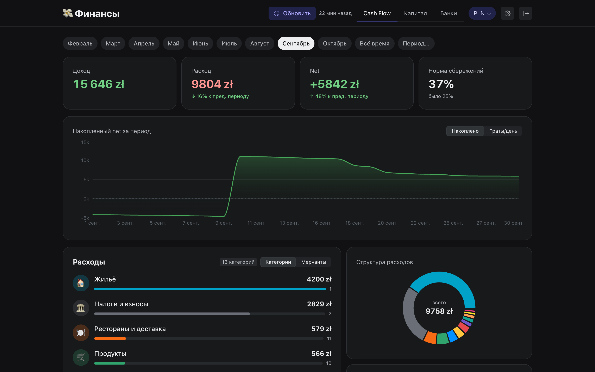
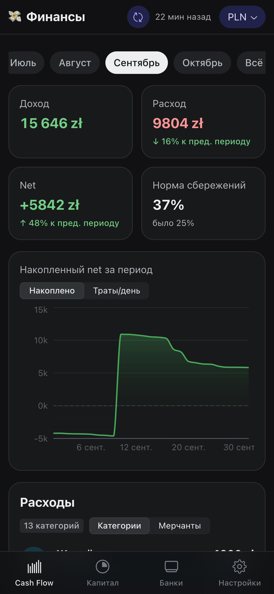
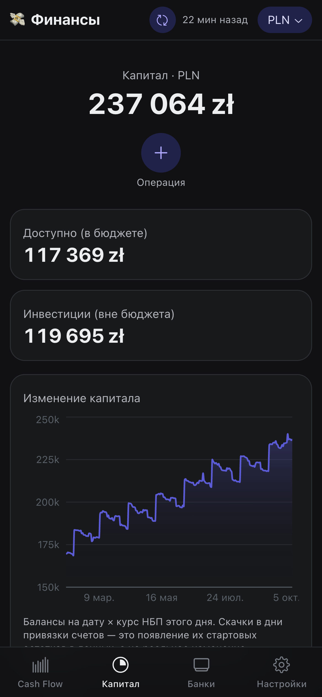
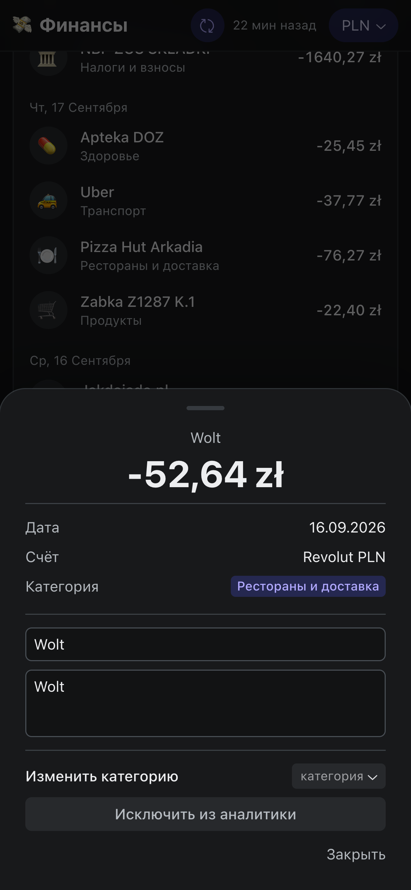
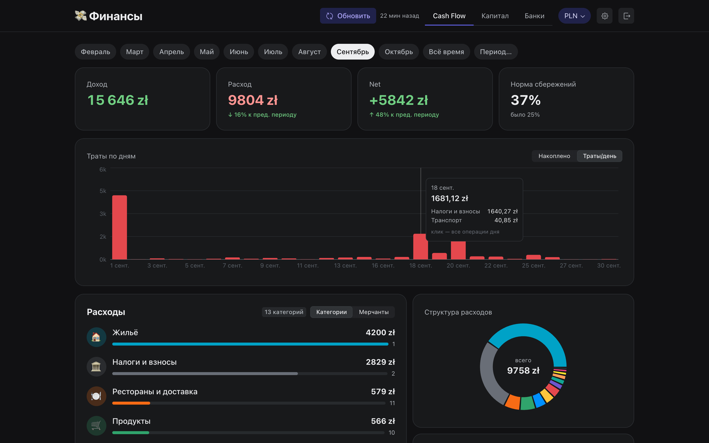
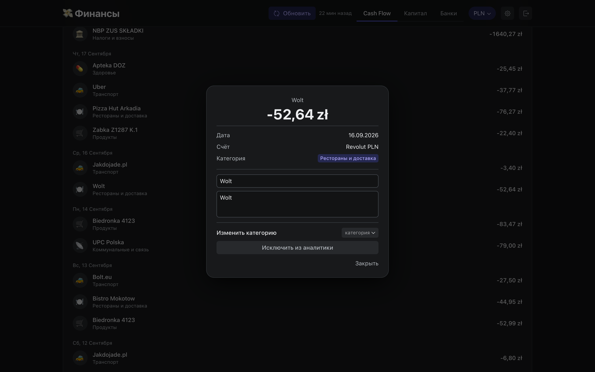
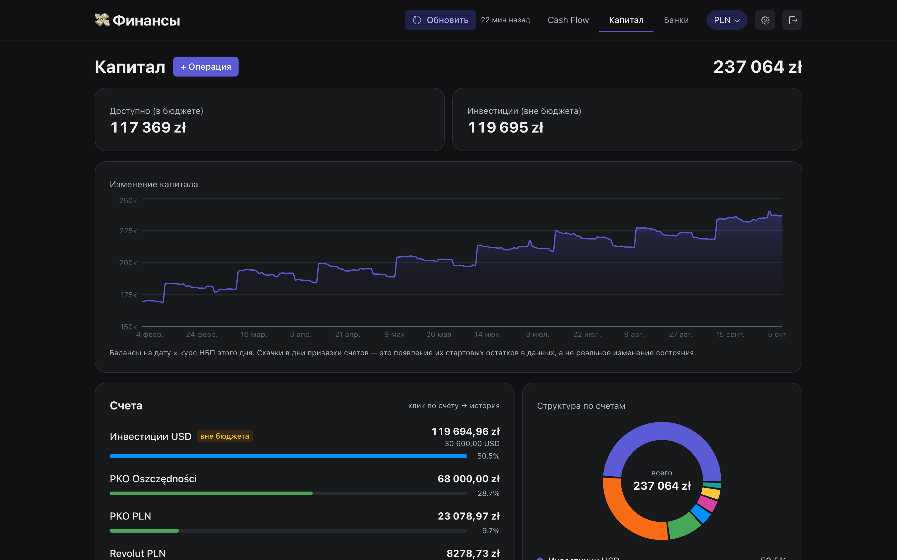
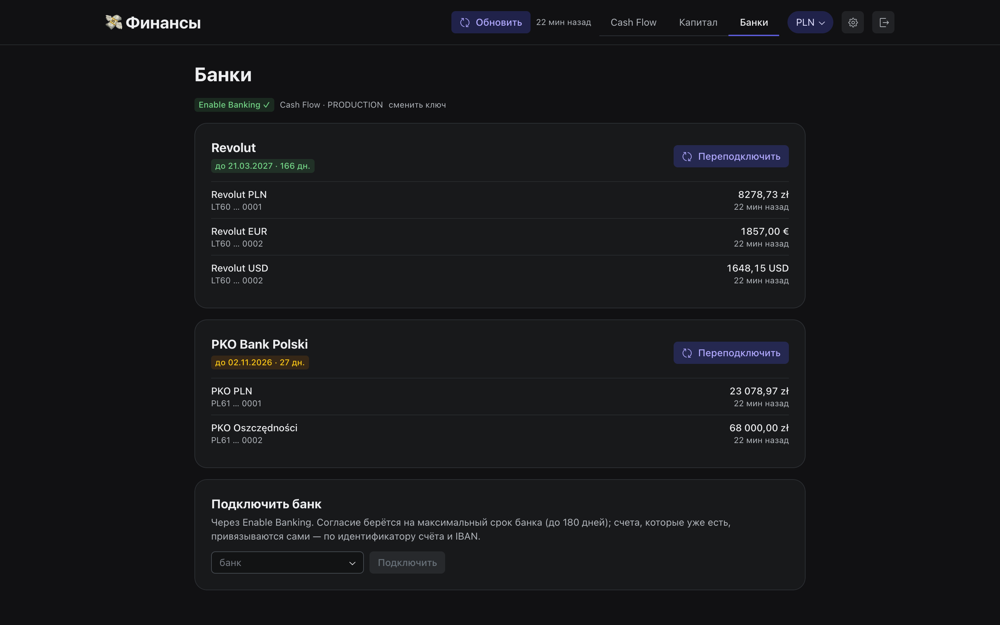
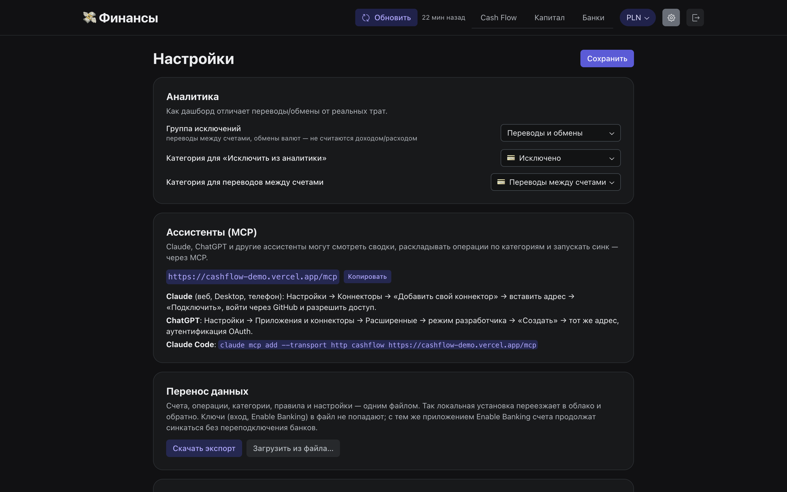
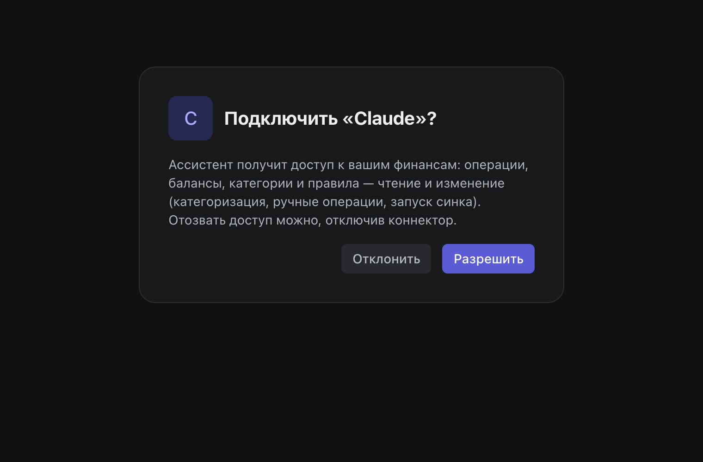

# Cash Flow

Личная финансовая аналитика для **мультивалютных** банков (Revolut, PKO BP и др. через
[Enable Banking](https://enablebanking.com)): дашборд в стиле Revolut с честной конвертацией валют
по курсу НБП на дату каждой операции, правила автокатегоризации и MCP-сервер, чтобы с финансами
можно было работать из Claude или ChatGPT.



<p align="center">
  &nbsp;
  &nbsp;
  
</p>

Два варианта установки, код один:

- **Облако (Vercel)** — своя копия в один клик, вход через GitHub, база Turso, доступ отовсюду и
  подключение к Claude / ChatGPT как коннектор. → **[DEPLOY.md](DEPLOY.md)**
  Обновления приходят в копию сами (Actions → «Обновиться из MoreBlood/cash-flow», еженедельно и по кнопке).
- **Локально (Mac)** — процесс под launchd, база — файл SQLite, бэкапы в iCloud; данные не покидают
  машину. → ниже.

> ⚠️ Проект не связан с Revolut, PKO BP или Enable Banking.
> Это личный pet-project, а не финансовый совет. Используйте на свой риск.

---

## Стек

| Часть | Что |
|---|---|
| Сервер | TypeScript, [Hono](https://hono.dev) (`src/`), запускается Node напрямую, без сборки |
| База | SQLite / [Turso](https://turso.tech) через [Drizzle ORM](https://orm.drizzle.team) (libSQL); миграции — `drizzle-kit` |
| Вход и OAuth для MCP | [Better Auth](https://better-auth.com): GitHub + плагин `mcp` (OAuth 2.1, DCR/CIMD, PKCE) |
| MCP | официальный SDK `@modelcontextprotocol/server` (Streamable HTTP) |
| Банки | Enable Banking API (`src/lib/eb.ts`) |
| Фронтенд | React 19 + TypeScript + Vite + Radix Themes + recharts + Biome, FSD (`web/`) |

Код сервера: `src/http.ts` (маршруты), `src/service/` (аналитика, справочники, синк), `src/mcp.ts`
(инструменты для ассистентов), `src/db/` (схема, сиды), `src/lib/` (Enable Banking, курсы НБП, правила).
Точки входа: `src/index.ts` — Vercel, `src/local.ts` — локальный сервер.

### Возможности

- Сводка за месяц / период: доход, расход, net, норма сбережений, график накопленного net и трат по
  дням (с разбивкой «на что» и операциями дня); категории с раскрытием до мерчантов.
- **Мультивалютность**: валюта — свойство счёта (у банковских приходит из банка), пересчёт в
  PLN/USD/EUR/CHF по кросс-курсу НБП на дату.
- Правка из UI: категория с охватом (одна / период / вся история + правило), получатель, заметка;
  ручные операции и переводы; категории (создание, слияние); правила (поиск, добавление, применение).
- **«Капитал»**: балансы всех счетов, история капитала, структура.
- **«Банки»**: срок согласия PSD2, баланс по данным банка, статус синка, переподключение в один клик
  (счета перепривязываются сами по `identification_hash`, затем IBAN + валюта).
- **MCP**: сводки, операции, категоризация с правилами, балансы, капитал, синк — 18 инструментов.
- **С телефона** — как приложение: нижний таб-бар, карточки операций шторкой снизу.

### Скриншоты

<table>
  <tr>
    <td width="50%"><br><sub>Траты по дням — на что ушли деньги, клик открывает операции дня</sub></td>
    <td width="50%"><br><sub>Карточка операции: категория, получатель, заметка, исключение из аналитики</sub></td>
  </tr>
  <tr>
    <td><br><sub>Капитал: все счета в базовой валюте, история и структура</sub></td>
    <td><br><sub>Банки: срок согласия PSD2, балансы и переподключение в один клик</sub></td>
  </tr>
  <tr>
    <td><br><sub>Настройки: MCP-коннектор, перенос данных, категории и правила</sub></td>
    <td><br><sub>Подключение Claude / ChatGPT — OAuth, один клик</sub></td>
  </tr>
</table>

<sub>Данные на скриншотах вымышленные (`scripts/demo-data.ts`).</sub>

---

## Локальная установка (Mac)

Нужен **Node.js ≥ 22.18** и приложение Enable Banking (см. шаг 3 в [DEPLOY.md](DEPLOY.md), redirect URL
`https://localhost:5443/enablebanking/auth_callback`).

```bash
git clone https://github.com/MoreBlood/cash-flow.git && cd cash-flow   # не в ~/Documents: туда launchd не пускает
cp .env.example .env && chmod 600 .env                                  # EB_APP_ID, EB_KEY_FILE
./cashflow.sh install                                                   # зависимости, фронт, launchd-агент, запуск
```

Дашборд — **http://localhost:5055**. Локально вход не нужен: сервер слушает только 127.0.0.1.
Банк при привязке вернёт на `https://localhost:5443` (самоподписанный сертификат — браузер один раз
спросит). Claude Code подключается так: `claude mcp add --transport http cashflow http://localhost:5055/mcp`.

```bash
./cashflow.sh status          # агент, последний синк, сроки согласий
./cashflow.sh start | stop | restart
./cashflow.sh logs            # data/logs/server.log
./cashflow.sh build           # пересобрать фронтенд в public/ (рестарт не нужен)
./cashflow.sh dev             # Vite :5173 с hot-reload поверх сервера :5055
./cashflow.sh sync            # банк-синк сейчас
./cashflow.sh backup [--full] # снапшот в iCloud
```

### Бэкап и восстановление

- После каждого синка сервер кладёт консистентный снапшот базы (`VACUUM INTO` + gzip) в
  `ICLOUD_BACKUP_DIR`: `cashflow-<дата>.sqlite.gz`, хранятся последние `BACKUP_KEEP`.
- Полный бандл (база + `.env` + `secrets/` + `personal/`) — `./cashflow.sh backup --full`, после смены
  секретов или конфига. Секреты при этом уходят в iCloud — осознанный компромисс.

Пошагово — **[RESTORE.md](RESTORE.md)**.

---

## Разработка

```bash
npm ci && npm ci --prefix web
npm run typecheck              # сервер
npm run build --prefix web     # фронт → public/
npm run db:generate            # миграция после правки src/db/schema.ts
npm run auth:schema            # схема таблиц Better Auth после обновления better-auth / плагинов
```

Скриншоты для README снимаются на демо-данных через установленный Chrome:

```bash
DB_PATH=.scratch/demo.sqlite PORT=5070 HTTPS_PORT=0 AUTO_SYNC=off npm start     # пустая база, отдельный порт
node scripts/demo-data.ts | curl -s -X POST localhost:5070/api/import -H 'Content-Type: application/json' --data @-
DEMO_URL=http://localhost:5070 node scripts/screenshots.ts                       # → docs/screenshots/
```

Как работает синк: окно запроса — 14 дней до последней проведённой операции (не дальше 89 дней),
дедупликация по id операции в банке; pending импортируются сразу и обновляются при проведении,
отменённые блокировки удаляются; новые операции категоризируются правилами; ручные правки
(категория, получатель, заметка) синк не перезаписывает.

## Приватность

Каждая установка хранит только данные своего владельца. Наружу: банковский синк через Enable Banking,
курсы НБП и (в облаке) база в вашем аккаунте Turso. Секреты — в `.env` / `secrets/` локально или в
переменных окружения Vercel.

## Лицензия

[MIT](LICENSE). Нормализация операций Enable Banking перенесена из
[actual-server](https://github.com/actualbudget/actual) (MIT).

> UI пока на русском языке.
